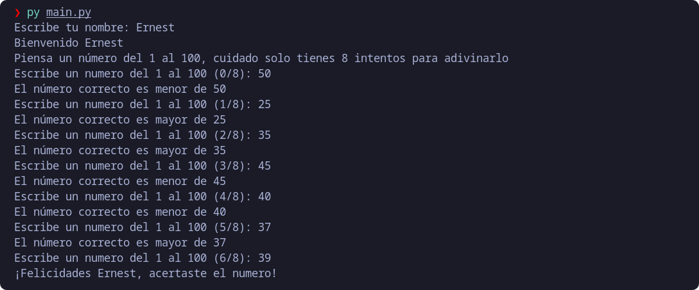

## Project 1: Guess a number
It consists of guessing a number from 1 to 100, having 8 attempts to get it right, the program will tell us if the entered value is less or greater than the number to be guessed.

### Demo:
https://replit.com/@emagrina/Leaning-PythonProject1?v=1

