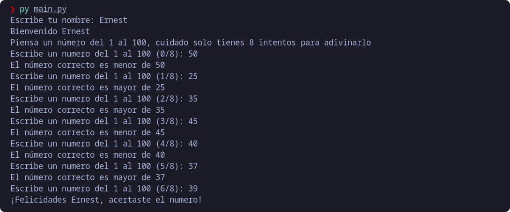

# Learning-Python

 ***Language***
- [🇪🇸 Español](https://github.com/emagrina/Learning-Python/blob/main/README.es.md)
- 🇺🇸 English

## Index

- [Overview](#Overview)
- [Project  1: Guess a number](#project_1)
- [Project  2: Hangman game](#project_2)
- [Project  3: Recipe book](#project_3)
- [Project  4: Bank account](#project_4)
- [Project  5: Turn-based console](#project_5)
- [Project  6: Serial number finder](#project_6)
- [Project  7: Space invasion game](#project_7)
- [Project  8: Web data extractor](#project_8)
- [Project  9: Restaurant manager](#project_9)
- [Project 10: Voice assistant](#project_10)
- [Project 11: Attendance Controller](#project_11)
- [Project 12: Machine learning](#project_12)
- [Project 13: Scrum App](#project_13)

## Overview
 I'm learning Python, and I'm doing several mini projects, we will gradually increase the difficulty.

[<h2 id="project_1">Project 1: Guess a number</h2>](Projects/Project_1)
It consists of guessing a number from 1 to 100, having 8 attempts to get it right, the program will tell us if the entered value is less or greater than the number to be guessed.

### Demo:
https://replit.com/@emagrina/Leaning-PythonProject1?v=1

[<h2 id="project_2">Project 2: Hangman game</h2>](Projects/Project_2)
Coming soon...

[<h2 id="project_3">Project 3: Recipe book</h2>](Projects/Project_3)
Coming soon...

[<h2 id="project_4">Project 4: Bank account</h2>](Projects/Project_4)
Coming soon...

[<h2 id="project_5">Project 5: Turn-based console</h2>](Projects/Project_5)
Coming soon...

[<h2 id="project_6">Project 6: Serial number finder</h2>](Projects/Project_6)
Coming soon...

[<h2 id="project_7">Project 7: Space invasion game</h2>](Projects/Project_7)
Coming soon...

[<h2 id="project_8">Project 8: Web data extractor</h2>](Projects/Project_8)
Coming soon...

[<h2 id="project_9">Project 9: Restaurant manager</h2>](Projects/Project_9)
Coming soon...

[<h2 id="project_10">Project 10: Voice assistant</h2>](Projects/Project_10)
Coming soon...

[<h2 id="project_11">Project 11: Attendance Controller</h2>](Projects/Project_11)
Coming soon...

[<h2 id="project_12">Project 12: Machine learning</h2>](Projects/Project_12)
Coming soon...

[<h2 id="project_13">Project 13: Scrum App</h2>](Projects/Project_13)
Coming soon...
