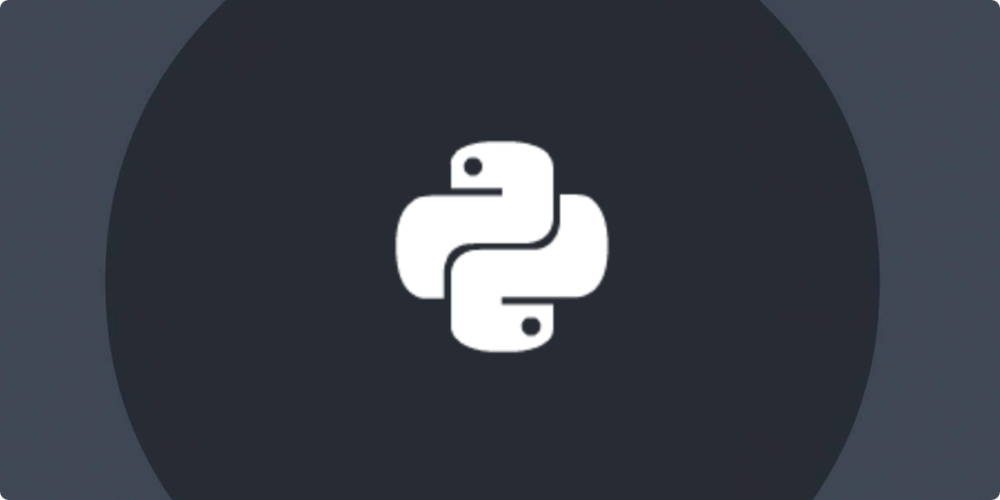

# Learning-Python

 ***Language***
- [🇪🇸 Español](https://github.com/emagrina/Learning-Python/blob/main/README.es.md)
- 🇺🇸 English

## Index

- [Overview](#Overview)
- [Project 1](#project_1)
- [Project 2](#project_2)
- [Project 3](#project_3)
- [Project 4](#project_4)
- [Project 5](#project_5)
- [Project 6](#project_6)
- [Project 7](#project_7)
- [Project 8](#project_8)
- [Project 9](#project_9)
- [Project 10](#project_10)
- [Project 11](#project_11)
- [Project 12](#project_12)
- [Project 13](#project_13)

## Overview
 I'm learning Python, and I'm doing several mini projects, we will gradually increase the difficulty.

## Project_1
Coming soon...

## Project_2
Coming soon...

## Project_3
Coming soon...

## Project_4
Coming soon...

## Project_5
Coming soon...

## Project_6
Coming soon...

## Project_7
Coming soon...

## Project_8
Coming soon...

## Project_9
Coming soon...

## Project_10
Coming soon...

## Project_11
Coming soon...

## Project_12
Coming soon...

## Project_13
Coming soon...
